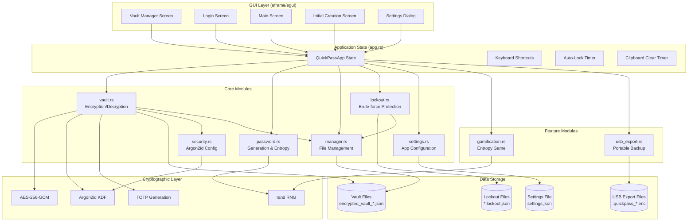
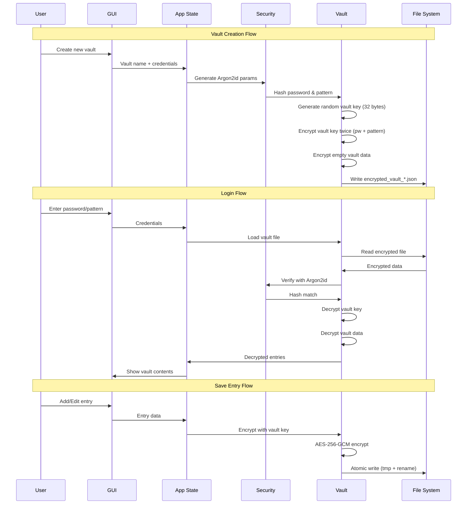

# QuickPass Architecture

## System Architecture Diagram

## Data Flow Diagram

## Architecture Overview

### Design Philosophy

I built QuickPass with a security-first mindset while maintaining usability. The architecture follows these key principles:

1. **Defense in Depth**: Multiple layers of security protect user data - Argon2id for key derivation, AES-256-GCM for encryption, and zeroize for secure memory clearing.

2. **Fail-Secure Design**: The lockout system progressively restricts access on failed attempts, eventually deleting vaults after too many failures to prevent brute-force attacks.

3. **Minimal Trust Surface**: All sensitive operations happen locally. No network requests, no telemetry, no cloud sync.

### Key Architectural Decisions

#### Dual Authentication System
I implemented both master password and visual pattern unlock because:
- Users can choose their preferred method based on context
- Pattern provides visual/spatial memory alternative for users who struggle with passwords
- The vault key is encrypted under both credentials, allowing either to unlock

#### Per-Vault Random Salt
Each vault gets its own cryptographically random salt rather than a global salt:
- Prevents rainbow table attacks across vaults
- Isolates vault security - compromising one vault's salt doesn't help attack others
- Follows modern cryptographic best practices

#### Vault Key Architecture
Instead of directly encrypting vault data with the password-derived key:
- A random 32-byte vault key encrypts the actual data
- This vault key is encrypted under both password and pattern
- Changing password/pattern only requires re-encrypting the vault key, not all data

#### Atomic File Writes
All vault saves use a write-to-temp-then-rename pattern:
- Prevents data corruption from interrupted writes
- Ensures vault files are always in a valid state
- Critical for a password manager where data loss is catastrophic

#### Module Separation
I separated concerns into focused modules:
- `vault.rs`: Pure encryption/decryption logic
- `security.rs`: Argon2id configuration isolated for easy auditing
- `manager.rs`: File system operations with path sanitization
- `lockout.rs`: Brute-force protection as independent module
- `app.rs`: GUI state management separate from crypto

### Security Model Summary

| Layer | Protection | Implementation |
|-------|-----------|----------------|
| Key Derivation | Memory-hard hashing | Argon2id (19-64 MiB) |
| Data Encryption | Authenticated encryption | AES-256-GCM |
| Memory Safety | Secure memory clearing | zeroize crate |
| Brute-force | Progressive lockouts | Exponential backoff |
| Path Safety | Input sanitization | Strict vault name validation |

### Limitations I Acknowledge

1. **No Browser Integration**: QuickPass is standalone - users must manually copy passwords
2. **No Sync**: Each device maintains its own vaults (USB export provides manual transfer)
3. **Platform Signing**: macOS/Windows binaries are unsigned, requiring manual trust approval
4. **Single-User Design**: No multi-user or sharing features
